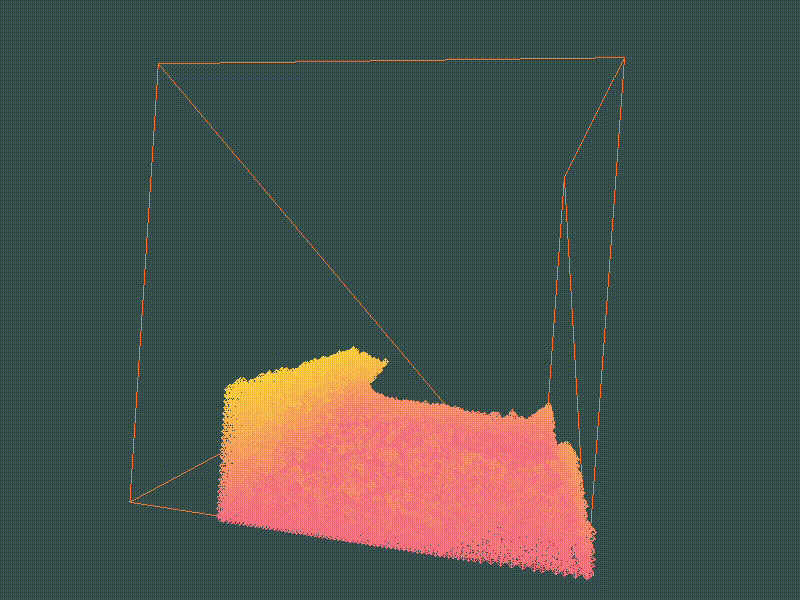

# PBF

## Goal

- Implement both the CPU and GPU version of the Position Based Fluid

## Progress

- [x] CPU impl
- [x] GPU impl
- [ ] Refactor
- [ ] Enhancement
- [ ] Optional build on GPU impl

## Some Images

Wave simulation using ~15,000 particles on NVIDIA GeForce GTX 960M.

OpenGL coordinate system reference

## TODO

See [Issues](https://github.com/k-ye/PbfVs/issues)

## Dependency

- OpenGL
- glfw3
- GLEW
- glm (header-only library)
- CUDA 8.0 (this should be optional)

## Project Setup

- All the third party dependency headers should be inside `C:\ThirdParty\Include`.
- All the third party dependency libraries should be inside `C:\ThirdParty\Libs`.